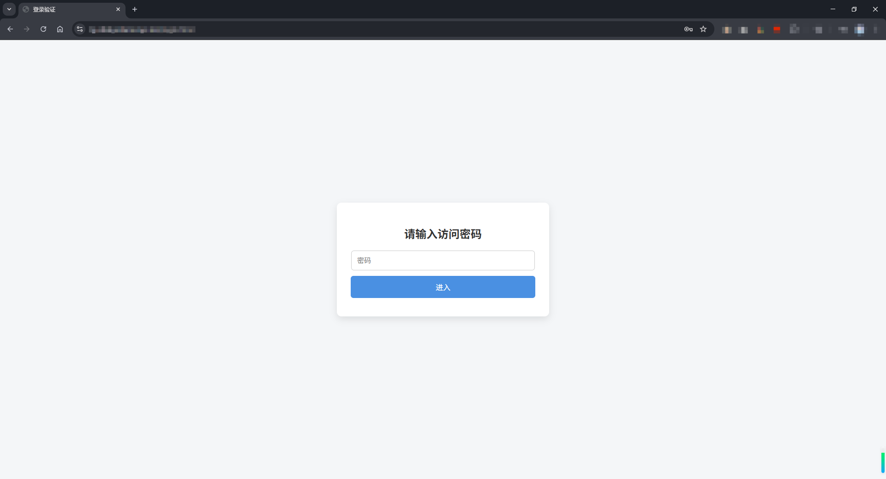
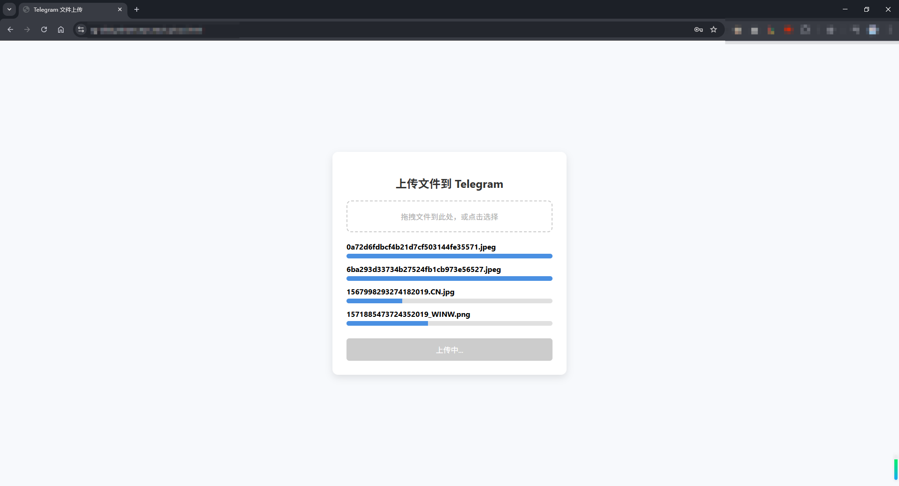
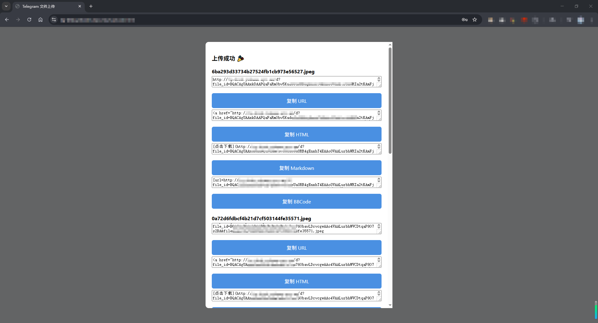

# tg-disk

> 🤖利用Telegram接口，♾️️无限容量，不限制文件格式，不限制文件内容😏，占用很少的内存和磁盘空间📁（可执行文件不到6MB，docker镜像不到20MB），轻巧方便。 文件都存储在Telegram☁️端，拥有良好的安全性🔒和持久性。 单个文件大小不能超过20MB。，上传成功会生成HTML、Markdown、BBCode三种形式的外链🔗，可以用来当做图床、文件下载url。

## 💻如何部署

### 命令行直接运行

>下载 [Releases](https://github.com/Yohann0617/tg-disk/releases) 中最新的符合自己环境的可执行文件，执行`chmod +x tg-disk-xxx`赋权

#### Linux环境

- `-port`：服务运行端口（可以不用配置，默认为8080）
- `-bot_token`：Telegram机器人Token
- `-chat_id`：Telegram个人ID（由于目前没有任何交互，暂时可以不用配置）
- `-access_pwd`：前端 web 页面访问的密码，出于安全考虑，必须配置
- `-proxy`：代理url（可以不用配置，目前仅支持HTTP代理）

完整命令后台运行：

```bash
nohup ./tg_disk -port 8080 -bot_token 7430196666:AAHgQ_XXXX -chat_id 6194666666 -access_pwd yohann -proxy http://127.0.0.1:10808 > /dev/null 2>&1 &
```

快速启动后台运行：

```bash
nohup ./tg_disk -bot_token 7430196666:AAHgQ_XXXX -access_pwd yohann > /dev/null 2>&1 &
```

#### Windows环境

参数同Linux环境，后台运行自行研究，以下是示例：

```
tg_disk.exe -port 8080 -bot_token 7430196666:AAHgQ_XXXX -chat_id 6194666666 -access_pwd yohann -proxy http://127.0.0.1:10808
```

### Docker部署

#### 1. 创建目录以及配置文件

```bash
mkdir -p /app/tg-disk && cd /app/tg-disk
```

```bash
# 自行修改后运行
cat > .env <<EOF
PORT=8080
BOT_TOKEN=7430196666:AAHgQ_XXX
CHAT_ID=6194666666
ACCESS_PWD=yohann
PROXY=
EOF
```

#### 2. docker-compose 一键部署

下载 [docker-compose.yaml](https://github.com/Yohann0617/tg-disk/blob/master/docker-compose.yaml) 文件，如需配置**HTTPS**，建议修改为以下内容，防止其他人直接通过IP+端口直接访问：

```yaml
services:
  tg-disk:
    image: ghcr.io/yohann0617/tg-disk:master
    container_name: tg-disk
    restart: always
    ports:
      - "127.0.0.1:8080:8080" # 修改项，端口可以自行修改
    volumes:
      - .env:/app/.env
```

一键启动：

```bash
cd /app/tg-disk && docker-compose up -d
```

## 👶如何使用

部署成功后，直接`http://IP:端口`即可访问，支持同时上传多个文件。单个文件大小**不能超过20MB**，否则无法通过URL下载。

### 🌏Nginx反向代理

核心配置：

```nginx
        location / {
            proxy_pass http://127.0.0.1:8080;
            proxy_set_header Host $host;
            proxy_set_header X-Real-IP $remote_addr;
            proxy_set_header X-Forwarded-For $proxy_add_x_forwarded_for;
            proxy_set_header X-Forwarded-Proto $scheme;
        }
```

## 🔍页面展示







## ⭐Stargazers over time

[](https://starchart.cc/Yohann0617/oci-helper)
